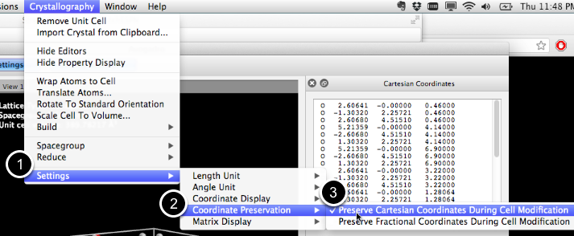
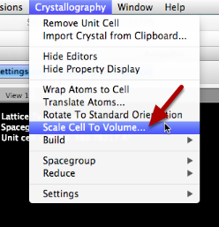
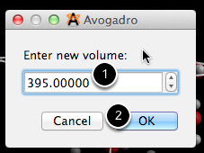
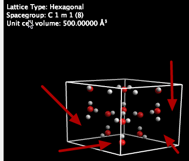
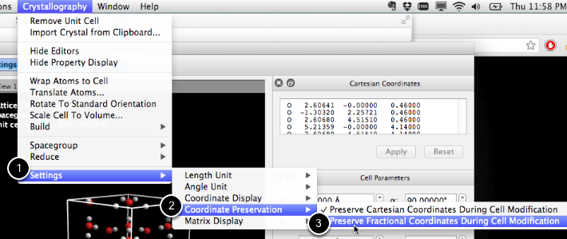
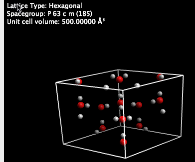

# Scaling Crystal Cell Volume

Avogadro 1.1 allows you to adjust the volume or spacing of a unit cell.

After creating or opening the crystal \(here ice\), we see the normal unit cell and lattice information. We will now adjust the cell volume.

Before we scale volume, we can either choose to preseve Cartesian coordinates \(which will add empty space to the edges of the unit cell\) or preserve fractional coordinates \(which will symmetrically scale the entire unit cell\). This walk-through will show both.

First we'll scale the cell while preserving Cartesian coordinates.

The units of the volume are determined by your settings \(here Å\). We adjust the volume from the original 389.78Å3, and click "OK."

Here, we've greatly exaggerated the volume, to show the empty space \(arrows\) around the outside of the unit cell boundaries, when preserving Cartesian coordinates. The space group has also changed \(to C 1 m 1\).

If you preserve fractional coordinates, you can scale the unit cell symmetrically.

Note that while the volume is significantly expanded, the space group \(and fractional coordinates\) are retained.

