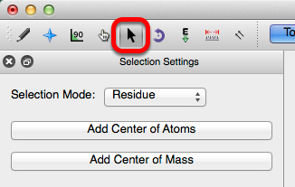

# Making Selections

The selection tool is also a useful feature to master when beginning to learn Avogadro. Generally, the selection tool allows for the individual selection of atoms, bonds, or fragments.

There are three types of selection modes: "Atom/Bond", "Residue", and "Molecule".

The "Atom/Bond" selection mode provides you with the ability to select a single atom within a molecule. This is achieved by left clicking the atom. Press and holding the "shift" key allows for the selection of multiple atoms.

Right clicking on the black display will clear the selection made.

The "Residue" selection mode selects an entire residue within a molecule. A residue is selected by clicking on a single atom within the residue.

The "Molecule" selection mode selects the entire molecule by clicking on an atom. Double clicking an atom in the molecule will also select the entire molecule.

Clicking and dragging your cursor is another way molecules, or fragments of molecules can be selected.

More information on selections can be found in the "Tools" section.

