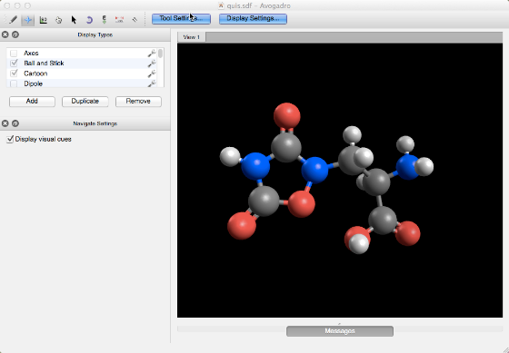
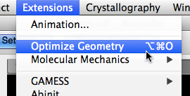
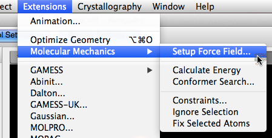
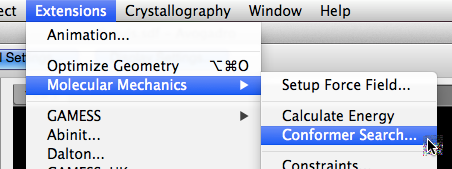

# Finding Conformers of Molecules

How to search for low-energy conformations

## Start with your molecule of interest

## Optimize the geometry

Before finding a low-energy conformer, we should make sure the current geometry is at least a near-optimal geometry. Perform an "Optimize Geometry" for a quick clean-up.

Now we will want to change the force field and/or the number of optimization steps.

## Change the force field options

You may want to change the force field used. MMFF94 is a good default for organic-like molecules. If the molecule contains metals or is otherwise unusual, UFF is a better choice. Next, change the number of geometry optimization steps — for each conformer tested, it will be optimized. Switch to a small number like 20 or 50 for a quick clean-up to prevent "clashing" atoms when bonds are rotated.

## Set the conformer search options

## Pick a search method and start the search

1\) Pick a search method. Systematic searches are exhaustive, but will always find the global minimum. A Weighted rotor search or Genetic Algorithm search are preferred. 2\) If you pick a Weighted Search, set the number of conformers to test \(e.g., 200\). 3\) If you pick the Genetic Algorithm search, set the options, including the Energy scoring method. 4\) Click "OK" to start the search.

